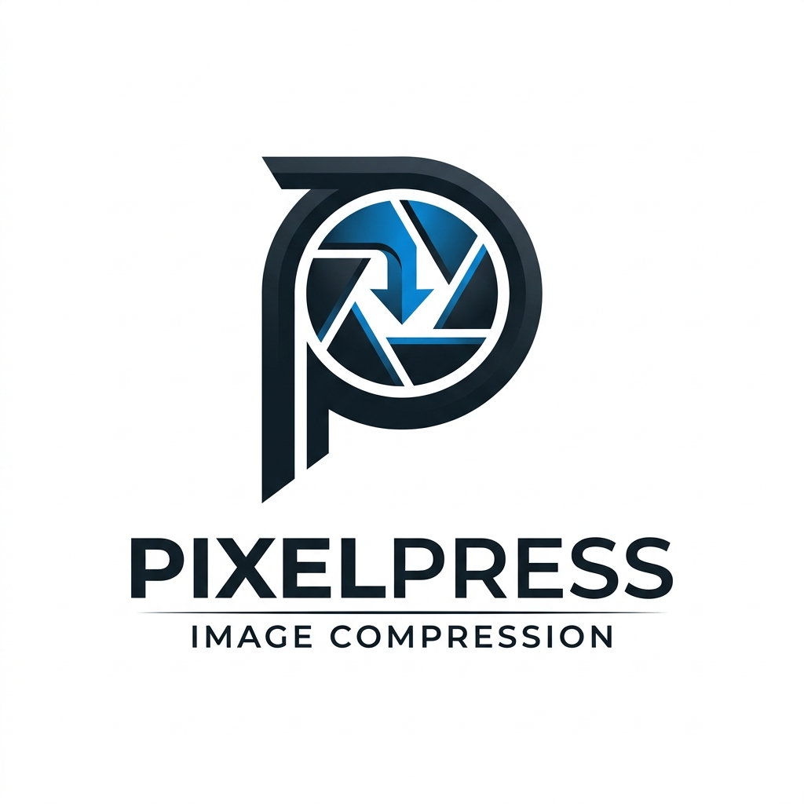

# PixelPress

PixelPress is a high-performance, privacy-focused image compression engine that runs entirely in your browser. Optimize your images without ever uploading them to a server.

<p align="center">
  
</p>

## 🚀 Key Features

- **100% Client-Side Processing****: Powered by native browser APIs. Your files never leave your device, ensuring total privacy.
- **Batch Optimization**: Upload and compress multiple images simultaneously.
- **Smart Format Conversion**: Seamlessly convert between **PNG**, **JPEG**, and **WebP**.
- **Adjustable Quality**: Fine-tune the balance between file size and visual fidelity.
- **Batch Download**: Export all optimized images as a single, organized ZIP file.
- **Zero "Negative Compression"**: PixelPress intelligently detects if optimization would result in a larger file and preserves the original instead.

## 🛠️ Technology Stack

- **Framework**: [Next.js](https://nextjs.org/) (App Router)
- **UI Logic**: [React](https://react.dev/)
- **Styling**: Vanilla CSS with CSS Modules
- **Icons**: [Lucide React](https://lucide.dev/)
- **Utilities**: [JSZip](https://stuk.github.io/jszip/) for batch exports

## 🏃 Getting Started

### Prerequisites

- Node.js 18.x or later
- npm / yarn / pnpm

### Installation

1. Clone the repository:
   ```bash
   git clone https://github.com/belkysupreme22/PixelPress.git
   ```

2. Install dependencies:
   ```bash
   npm install
   ```

3. Start the development server:
   ```bash
   npm run dev
   ```

4. Open [http://localhost:3000](http://localhost:3000) in your browser.

## 🛡️ Privacy & Security

Unlike traditional online compressors, PixelPress does not have a backend for image processing. Every byte of compression happens locally in your browser's memory using the Canvas API. This makes it ideal for sensitive documents or private photography.

---

Built with ❤️ for a faster, more private web.
